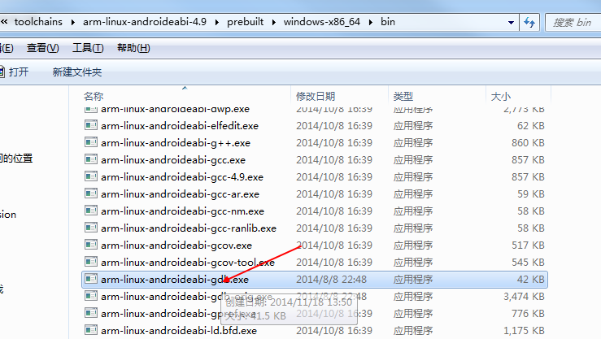

coredump是linux中定位程序异常退出的机制（Android基于Linux内核，所以coredump机制在Android环境中同样适用，使用方法稍有不同）。在CarLife项目中可以使用coredump机制，并借助GDB工具来定位Native层的异常退出，比如bdsc和bdcl的异常退出问题定位。
# Android coredump生成步骤如下:
* 增大ulimit空间限制
默认情况下coredump空间为0

增大coredump的方法有两种：
1 通过ulimit –c unlimited

2 在程序中修改

* 在Android.mk中添加调试选项（有利于查看调用堆栈信息）

* 准备好Android.mk和测试原文件（本测试中使用的Makefile和源文件内容如下）

* 将准备好的Makefile和源文件，进行交叉编译（下面的两种交叉编译方式可根据实际情况任意选择一种）
1 在Android源码环境中进行编译；
2 在NDK环境中进行编译；
* 获取生成的测试可执行文件
如果在Android源码环境下进行编译，需要选择out/target/product/generic/symbols/system/bin/目录下的生成可执行文件（该目录下的文件包含用于调试的符号信息）

如果在NDK环境下编译，可以选择armeabi或armeabi-v7a中的生成文件（armeabi是指的该可执行文件用于Arm的通用CPU；armeabi-v7a是指CPU支持硬件浮点运算；因此armeabi通用性强，但速度慢，而v7a能充分发挥v7a CPU的能力。armeabi就是针对普通的或旧的armcpu，armeabi-v7a是针对有浮点运算或高级扩展功能的arm cpu）

* 在Android环境中运行可执行文件，程序异常退出后，会在当前目录下产生coredump文件

# GDB的异常退出定位过程如下
* Windows环境下Android GDB工具位于NDK安装目录下android-ndk-r10c\toolchains\arm-linux-androideabi-4.9\prebuilt\windows-x86_64\bin（Android需要使用专门的GDB工具， 用于调试Linux的GDB不能用于Android环境调试）

* 按照可执行程序的生成目录路径创建对应目录，并将可以行文件拷贝到该目录下（也可直接复制生成文件和对应目录），本测试中测试的根目录为dd，则该过程为：

* 将coredump文件拷贝到测试根目录下

* 在GDB目录下运行GDB

* 针对测试可执行文件，执行file命令

* 使用core命令和bt命令定位异常退出位置

# 参考链接：
http://www.csdn123.com/html/exception/597/597343_597351_597349.htm
http://blog.csdn.net/liminled/article/details/17030747