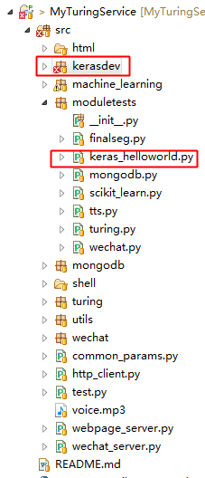

Keras是一个高层神经网络API，Keras由纯Python编写而成并基Tensorflow或Theano。Keras 为支持快速实验而生，能够把你的idea迅速转换为结果。

#  Keras在MyTuringService中的应用
项目中通过Keras构建了一个4输入、3输出、单隐藏层（16单元）的简单神经网络分类器。
代码参考：[https://github.com/fastforwardlabs/keras-hello-world/blob/master/kerashelloworld.ipynb](https://github.com/fastforwardlabs/keras-hello-world/blob/master/kerashelloworld.ipynb)

# 模块工程位置

其中，

* kerasdev：基于Keras的单层神经网络分类器模块；
* moduletests/keras_helloworld.py：模块测试程序；

# 项目地址
Java代码：[http://github.com/CaiquanLiu/MyWeChatService.git](http://github.com/CaiquanLiu/MyWeChatService.git)
Python代码：[https://github.com/CaiquanLiu/MyTuringService](https://github.com/CaiquanLiu/MyTuringService)