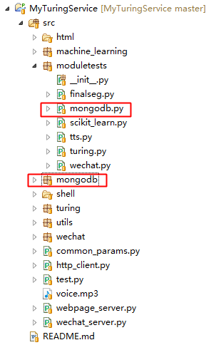

MongoDB 是一个基于分布式文件存储的数据库。由 C++ 语言编写。旨在为 WEB 应用提供可扩展的高性能数据存储解决方案。

MongoDB 是一个介于关系数据库和非关系数据库之间的产品，是非关系数据库当中功能最丰富，最像关系数据库的。

MyTuringService中引入了MongoDB作为数据持久化的数据库。

# 工程中MongoDB模块位置

其中，

* mongodb：MongoDB封装模块；
* moduletests/mongodb.py：MongoDB模块的测试代码；

# MongoDB项目地址:
[https://www.mongodb.com/](https://www.mongodb.com/)

# 项目地址
Java代码：[http://github.com/CaiquanLiu/MyWeChatService.git](http://github.com/CaiquanLiu/MyWeChatService.git)
Python代码：[https://github.com/CaiquanLiu/MyTuringService](https://github.com/CaiquanLiu/MyTuringService)
