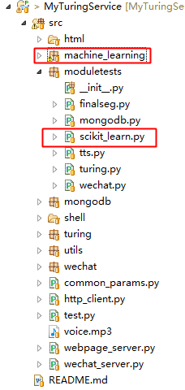

MyTuringService集成了基于Scikit-learn的机器学习模块，涵盖逻辑回归、朴素贝叶斯、K临近、决策树、支持向量机的算法。

# 模块工程位置

其中，

* machine_learning：机器学习方法模块；
* moduletests、scikit_learn.py：模块测试程序；

# 项目地址
Java代码：[http://github.com/CaiquanLiu/MyWeChatService.git](http://github.com/CaiquanLiu/MyWeChatService.git)
Python代码：[https://github.com/CaiquanLiu/MyTuringService](https://github.com/CaiquanLiu/MyTuringService)