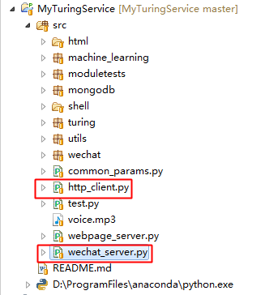

Python后台采用Tornado作为Web Server。Tornado的部署和使用非常简单。
# Tornado安装
    pip install tornado

# Hello World示例

    import tornado.ioloop
    import tornado.web

    class MainHandler(tornado.web.RequestHandler):
        def get(self):
            self.write("Hello, world")

    def make_app():
        return tornado.web.Application([
            (r"/", MainHandler),
        ])

    if __name__ == "__main__":
        app = make_app()
        app.listen(8888)
        tornado.ioloop.IOLoop.current().start()

# Tornado官方网址：
[http://www.tornadoweb.org/en/stable/](http://www.tornadoweb.org/en/stable/)

# 微信信息处理服务入口
MyTuringService接收并处理来自MyWeChatService的http请求。

其中，

* wechat_server.py：web Server入口；
* http_client.py：模拟微信请求（测试使用）；

# 项目地址
Java代码：[http://github.com/CaiquanLiu/MyWeChatService.git](http://github.com/CaiquanLiu/MyWeChatService.git)
Python代码：[https://github.com/CaiquanLiu/MyTuringService](https://github.com/CaiquanLiu/MyTuringService)