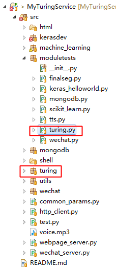

图灵机器接口是一个基于Http请求的智能问答接口，只要在其官网注册并申请AppID和AppKey即可使用该服务。

图灵机器人网址: [http://www.tuling123.com/](http://www.tuling123.com/)

# 模块工程位置

其中，

* turing：图灵机器人模块；
* moduletests/turing.py：模块测试程序；

# 项目地址
Java代码：[http://github.com/CaiquanLiu/MyWeChatService.git](http://github.com/CaiquanLiu/MyWeChatService.git)
Python代码：[https://github.com/CaiquanLiu/MyTuringService](https://github.com/CaiquanLiu/MyTuringService)