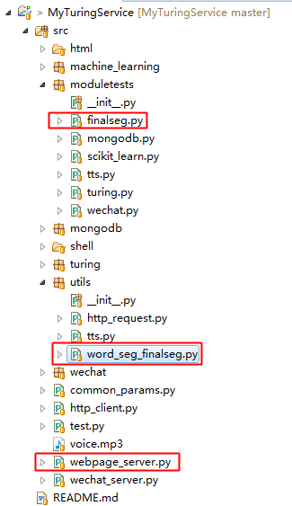

Finalseg算法是基于HMM模型,采用了Viterbi算法的分词Python工具包，简单易用，分词效果也不错。

# Finalseg项目地址
[https://github.com/fxsjy/finalseg](https://github.com/fxsjy/finalseg)

# 模块工程位置

其中，

* utils/word_seg_finalseg.py：Finalseg封装；
* moduletests/finalseg.py：Finalseg测试程序；
* webpage_server.py：Finalseg网页版测试程序（已部署在阿里云，可以通过[[http://120.25.220.14:8000/](http://120.25.220.14:8000/)]([http://120.25.220.14:8000/](http://120.25.220.14:8000/))访问）；

# 项目地址
Java代码：[http://github.com/CaiquanLiu/MyWeChatService.git](http://github.com/CaiquanLiu/MyWeChatService.git)
Python代码：[https://github.com/CaiquanLiu/MyTuringService](https://github.com/CaiquanLiu/MyTuringService)