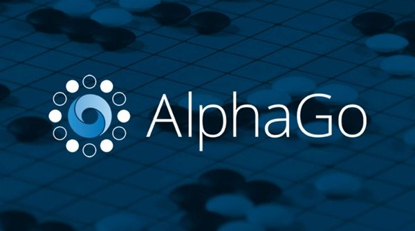

# 人工智能是什么
人工智能并不是一个新鲜的词汇，电影《钢铁侠》中的Javis就是一个非常典型例子。虽然Javis不是人类，但它却能像人类一样搜集信息、深入思考、提供建议、安排日常。

# 人工智能时代来临了
2016年3月来自Google团队的AlphaGo与韩国世界冠军李世石九段的在韩国首尔结束了首场比赛，AlphaGo获胜，李世石投子认输。

2017年1月来自Google团队的Master在多家网络围棋平台连续挑落世界围棋高手，连取60胜。
# 走进生活的人工智能
人工智能不仅出现在影视作品和科研项目中，同时，也慢慢融入我们的生活中。

自动驾驶领域，除了传统的汽车厂商，比如福特、丰田、奥迪等。Google、Uber、百度这样财大气粗的互联网巨头也纷纷加入鏖战。

语音助理领域，Google的Assistant、苹果 的Siri、微软的Cotana、亚马逊的Alexa、百度的DuerOS也早已走入大众生活。
# Eddy的AI小助手是什么
面对人工智能这波浪潮，作为爱动手的程序猿，肯定不能只限于听新闻，用产品这个层面啦，如果能亲手打造一款属于自己的人工智能系统，那是再好不过的事情了。而Eddy的AI小助手就是为了这个目的而诞生的。

Eddy的AI小助手是一个个人微信公众号：

这个个人的公众号主要是作为AI系统信息输入的入口，通过公众号微信页面就可以把请求的文本和语音请求发送到自己配置的后台服务器。后台服务器接收到文本和语音请求后，处理生成回复内容，并将结果以文本、页面或语音的形式返回给微信客户端。

自己实现的AI系统相比于“图灵机器人”这样的第三方服务有诸多优势：

* 自己搭建整个AI系统，能够增加自己的动手能力，并体验过程中的乐趣；
* 能够添加一些定制性的服务，比如“我最近一周有什么安排？”、“我的个人博客最近一周的访问量怎么样？”
* 除了使用第三方NLP平台接口外，也可以介入自己的算法模块，进行对比测试；

# 学习计划

AI小助手的搭建和知识学习过程我会以发表文章的形式记录在简书中，同时，AI小助手的代码实现我会上传的Github上，供大家探讨和学习：

Java代码：[github.com/CaiquanLiu/MyWeChatService.git](github.com/CaiquanLiu/MyWeChatService.git)

Python代码：[github.com/CaiquanLiu/MyTuringService](github.com/CaiquanLiu/MyTuringService)