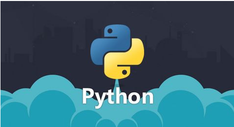

# Python后台处理模块接入的缘由

前面的后台搭建都是基于Java EE的，但后面随着对机器学习的深入，慢慢发现大多数机器学习的算法实现都是基于Python和R语言的。R语言主要集中在对数据的预处理、分析和展示，而Python不但囊括了R语言的功能，还延伸到了网络请求、Web服务、数据抓取等方方面面。Python不但在语法上入门简单、在开发环境的搭建上相对容易，开发IDE也很完善易用。在机器学习领域有很多现成的算法库，开源工具包非常完备。Python一旦入门，绝对会对它爱不释手的 :)

# Python学习的个人经验

既然是个人经验，就要先交代下自己在学习python之前的编程经历。从大学一年级接触C语言，并在大学二年级在电子设计竞赛中投入真正的开发使用，直到进入互联网公司之前，都是在使用C语言做底层驱动和中间件开发，使用C++做业务逻辑开发。进入互联网之后开始接触Java，并进行Android中间件和应用开发。在业余时间自学了Java EE的开发流程并了解了Web前端开发的基础知识。

我的Python学习比较简略：

## 快速入门

在网上看一篇关于Python的入门帖子，比如www.runoob.com/python/python-basic-syntax.html，在这个过程中了解语言特性和基本语法、搭建基本的运行环境，这个过程1~2个小时足矣。

## 全局把握

对Python有了基本的了解和认识后找一本大而全的教科书，比如《Python基础教程》（我找了本电子版），这是一本很厚的书。然后查看目录，并逐页“扫读”（所谓“扫读”就是非常快速的粗略阅读和跳读，在阅读的过程中并不需要逐行逐句，而是要粗枝大叶）。对于“魔法方法、属性和迭代器”这样的章节可以仔细研读，对于“条件、循环和其他语句”这样的章节可以一扫而过、对于“图形用户界面”这样的章节则可以直接跳过不看。整个过程的一个核心思想是：

1. 对比阅读，发掘Python相对于自己以往掌握的语言有哪些相同点和不同点；

2. 系统把握，明了整个Python语言的系统体系和知识组成；

3. 确定目标，扫读的目标是在后续如果遇到相应的Python问题，能够快速的定位到具体的知识点，并查询答案（这本大厚书可以在以后作为字典类的工具书使用）

第二个步骤需要半天到一天的时间。

## 工程实践

在Python终端敲简单的命令显然无法满足我们的工程需要，一个完整的工程开发需要便捷的开发工具和清晰的模块关系。这里我使用DevPy+Eclipse搭建IED开发环境，工程中引入包、模块、类等Python特性来明晰项目中的模块关系。在开发中遇到问题则通过查询《Python基础教程》或在网上搜寻解决方法。

# Python后台处理模块的功能和接入方式

Python的后台处理模块主要用来做机器学习相关的处理工作。Python模块引入了Tornado Web引擎，对外以REST API的形式提供服务。所以简单的说Python的后台处理模块也是像基于Java EE一样的Http Web服务。

# 后记（自己的语言学习感悟）

## 汇编语言

对于汇编语言相信绝大多数同学除了在《微机原理》的实验课上使用过之外，应该在真实工作中很少有接触，即便对于很多嵌入式开发的同学在工作中也很难接触的到。我在工作中唯一的实践经历是修改中断向量表。是在一个没有MMU的MCU上保证运行的ucOS系统能够有独立的Bios、Bootloader、App三个独立的运行空间。当时的解决方案是使用两级中断向量表：硬件触发中断后会自动跳转到第一级的中断向量表，而第一级的中断向量表直接指向第二级中断向量表。第二级中断向量表会通过检查硬件管脚的状态转跳到Bios、Bootloader、App不同空间的处理代码段。汇编语言的学习重点不是语言本身，而是机器运行的机制。

## C语言

相比于汇编C语言确实算是高级语言了。对于互联网的同学来说C语言的语法很简单，C语言的指针又很眩晕，在功能开发上，很简单的事情要写上一大堆代码。其实业务开发并不是C语言的优势所在，C语言更多是为了取代汇编，同样C语言的学习重点也不在于语言本身，更在于对系统运行机制的理解，所以，C语言更多的应用场景是驱动开发和协议解析。

## C++

相比于C语言，C++对业务逻辑的处理能力大大增强，同时，设计模式在C++中的应用也变得得心应手。但C++只能算的上C语言的升级版，作为程序员，并不能完全脱离系统原理的限制，将全部的注意力放在业务逻辑的实现上。但劣势同样也是优势，正是C++同系统的相关性才使得C++在嵌入式设备和实时性较高的核心中间件领域留有一席之地。

## Java

相对于C++，Java实现了完全的面向对象。从解放劳动力的角度讲，Java实现了一次飞跃。开发人员再也不用被底层的系统机制所牵绊，将自己的更多精力放在业务逻辑本身，同时，Java的各种工具支持包也很完备。这也很好的解释了，为什么嵌入式领域一个项目的开发周期往往是2~3年，开发成员往往是几十甚至是几百人。而互联网产品很多都是几个人或一个人，一周或一个月的作品。但不可否认，Java自身的运行机制，导致它对系统资源的高要求和运行时的低效率，这也是Java在特有领域不能完全替代C++的原因。

## Python

在接触Python之前，我一直认为Java是用起来最爽的语言（简单的运行和开发环境搭建、功能强大的IDE工具、完备的工具包支持），但接触到Python之后才发现我的结论下的太早了。相比于Java，Python除了是脚本语言、动态语言这样的基本属性之外，Python的一个很大的特点是简洁。Python能够使用更少的代码，更少的依赖完成你想要的工作。

当然语言和算法一样，没有一个算法能使用所有的场景，也没有一种语言能驾驭所有的领域。

