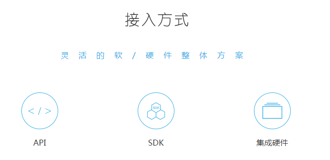
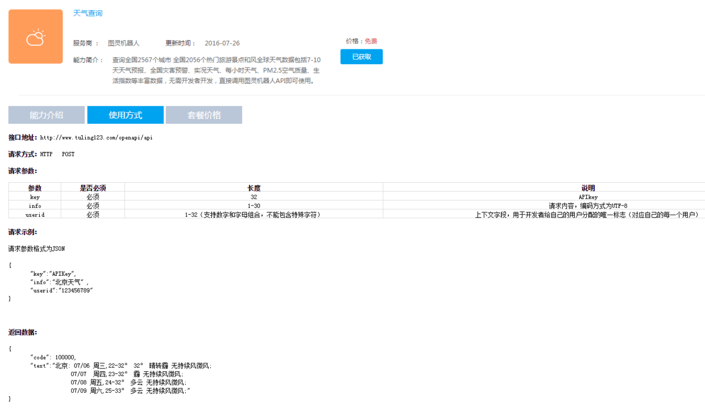
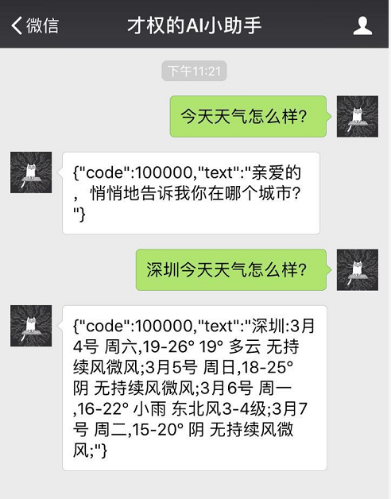

# 前期准备

通过前面的步骤，我们的后台服务器已经可以接收来自微信公众后的消息，并能够将处理的结果返回给微信公众号客户端。如果我们的后台服务器程序能够解析用户的请求意图，并将意图的处理结果返回给客户端，那么我们的AI小助手就具备了真正的“智慧”。

# 图灵机器人接口

对用户意图的理解，AI小助手使用了图灵机器人请求接口。图灵机器人的官方地址：[www.tuling123.com/](www.tuling123.com/)

图灵机器人有多种接入方式，

AI小助手采用API的形式接入图灵机器人。API的请求是基于Http的，支持Get和Post请求，请求和结果返回通过Json进行序列化。天气状况的请求和应答如下图所示：

# AI小助手接入演示

# 项目代码

Java代码：[github.com/CaiquanLiu/MyWeChatService.git](github.com/CaiquanLiu/MyWeChatService.git)
Python代码：[github.com/CaiquanLiu/MyTuringService](github.com/CaiquanLiu/MyTuringService)