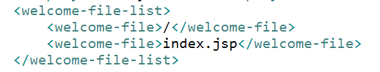
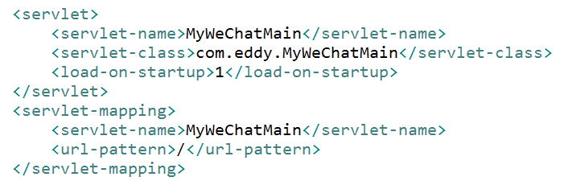

# WebApp对Http的默认响应设置

在没有指定具体的响应html页面、jsp页面或Servlet时，Tomcat将Http请求转发给对于的WebApp后，最终由WebApp中的哪一个.html页面、.jsp页面或Servlet来响应，是由web.xml中<welcome-file-list>标签内容决定的（jsp页面等同于Servlet对象）。

# 针对微信请求的web.xml修改

具体修改如下：

其中，MyWechatMain为Servlet类。

# 项目地址

Java代码：[github.com/CaiquanLiu/MyWeChatService.git](github.com/CaiquanLiu/MyWeChatService.git)

Python代码：[github.com/CaiquanLiu/MyTuringService](github.com/CaiquanLiu/MyTuringService)