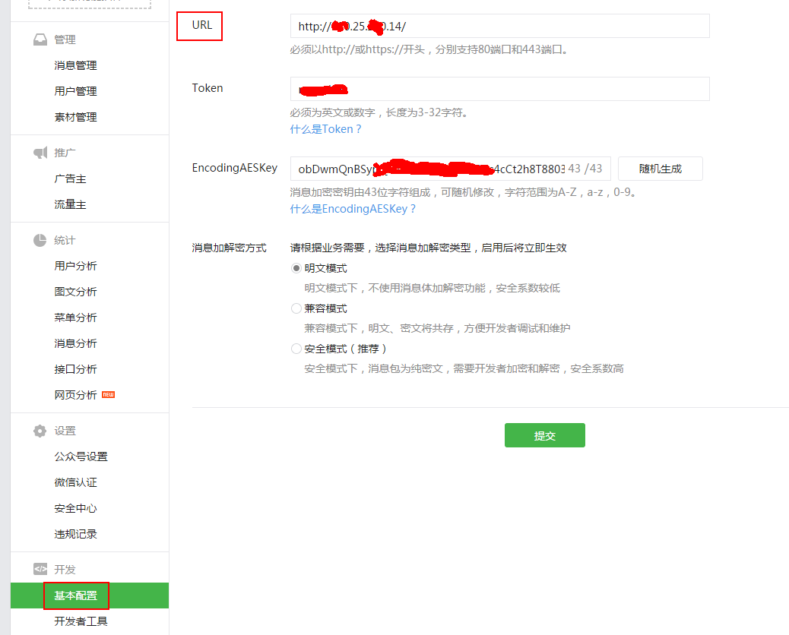
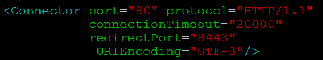
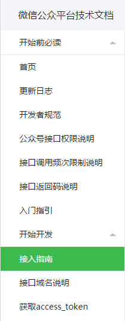
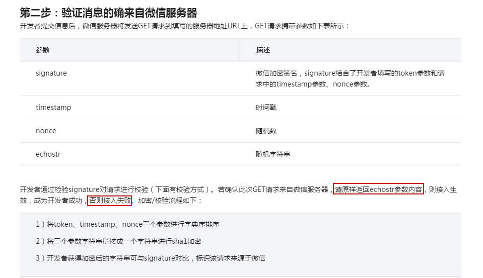
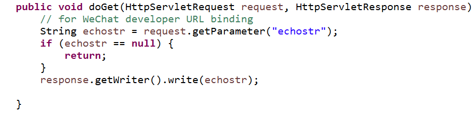

# 申请微信公众号

在微信公众平台申请个人的微信公众号：[mp.weixin.qq.com](mp.weixin.qq.com)

# 公众号设置

公众号设置只需关注“URL”即可，格式为:

    http://ip/

或

    https://ip/

“Token”和“EncodingAESKey”主要用于服务端对客户信息来源的检查，测试时，可以不用关心。

微信客户端发送到个人服务器的流程：微信客户端->微信后台服务器->个人后台服务器，Token和EncodingAESKey主要用来确保数据来源于微信的后台服务器。

# 服务器端口修改

微信的服务http请求端口为80（https请求为443），而Tomcat的http默认端口为8080，为了正确响应微信服务器的请求，需要修改Tomcat的http默认端口。修改Tomcat_Home/conf/server.xml，

# 服务器响应设置

微信开放平台设置URL时，微信服务器会向个人的URL服务器发送get请求。服务器端需要正确响应微信服务器发来的验证请求，否则URL设置会失败，

服务端代码，

# 项目代码

Java代码：[github.com/CaiquanLiu/MyWeChatService.git](github.com/CaiquanLiu/MyWeChatService.git)

Python代码：[github.com/CaiquanLiu/MyTuringService](github.com/CaiquanLiu/MyTuringService)