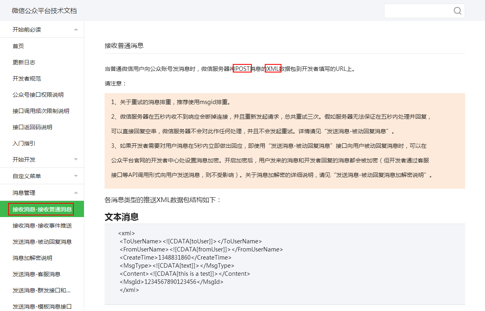

# 微信消息收发规范

微信使用POST请求形式来收发消息，消息以XML形式进行封装，

# 微信消息类型

* 消息类型包括：
* 文本消息
* 图片消息
* 语音消息
* 视频消息
* 小视频消息
* 地理位置消息
* 链接消息

# 微信消息的解析实现

微信消息的解析直接使用了黄路飞的代码（[www.cnblogs.com/huanglufei/p/5592072.html](www.cnblogs.com/huanglufei/p/5592072.html)）

其中，XML的解析使用了XStream组件。

# 项目地址

Java代码：[github.com/CaiquanLiu/MyWeChatService.git](github.com/CaiquanLiu/MyWeChatService.git)

Python代码：[github.com/CaiquanLiu/MyTuringService](github.com/CaiquanLiu/MyTuringService)