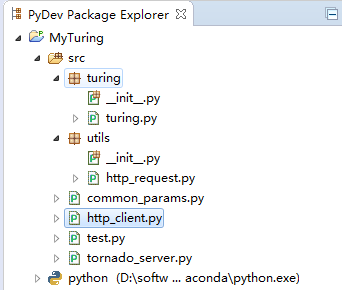
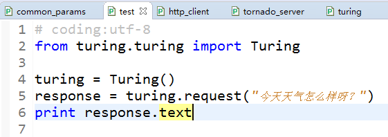
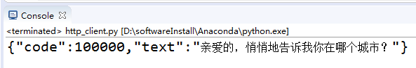
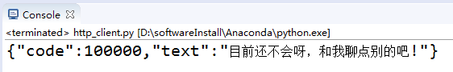

# Python数据处理模块结构总览

Python版本：2.7.13

Http Server：Tornado

Http请求库：Requests

IDE：PyDev+Eclipse

工程目录,

* turing：图灵机器人的请求封装模块（www.tuling123.com/）；
* utils：通用工具模块，当前只包含基于requests的http请求封装；
* common_params：通用的常量定义模块；
* http_request：http请求测试模块
* test：本地功能测试模块
* tornado_server：基于Tornado的web服务模块（部署在服务器中）

# 工程使用

## 本地功能测试

使用test进行本地功能的测试，比如测试本地的图灵请求功能，

## Tornado web服务部署

在服务器端启动tornado_server模块即可，

    #python tornado_server.py

## Http请求测试

在部署好tornado_server web服务后，使用http_request模块完成http请求测试。比如客户端请求服务端的图灵能力（服务端调用图灵接口），

其中，服务端与客户端之间基于Json进行通信。

# 项目代码

Java代码：[github.com/CaiquanLiu/MyWeChatService.git](github.com/CaiquanLiu/MyWeChatService.git)

Python代码：[github.com/CaiquanLiu/MyTuringService](github.com/CaiquanLiu/MyTuringService)