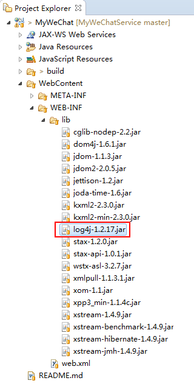

我们在调试的过程中可以在本地搭建Tomcat服务器，并使之与Eclipse环境相关联。同时，将Eclipse中开发的程序直接部署到本地的Tomcat中运行，从控制台查看打印信息（使用System.out.println（）即可）。但在实际的线上环境，是无法实时的查看控制台的打印信息的，我们需要将运行中打印的Log存放到文件中，然后查看文件中的Log信息。对于线上环境的Log打印，AI小助手采用了log4j组件。

# log4j组件使用的主要步骤

## 1 添加jar包

从log4j的官网上下载最新的jar包，并存放在工程的lib目录下，

## 2 添加log4j配置文件

在src同级创建并设置log4j.properties，

## 3 指定log文件的保存路径

## 4 在代码中添加log打印语句

# 项目代码

Java代码：[github.com/CaiquanLiu/MyWeChatService.git](github.com/CaiquanLiu/MyWeChatService.git)

Python代码：[github.com/CaiquanLiu/MyTuringService](github.com/CaiquanLiu/MyTuringService)