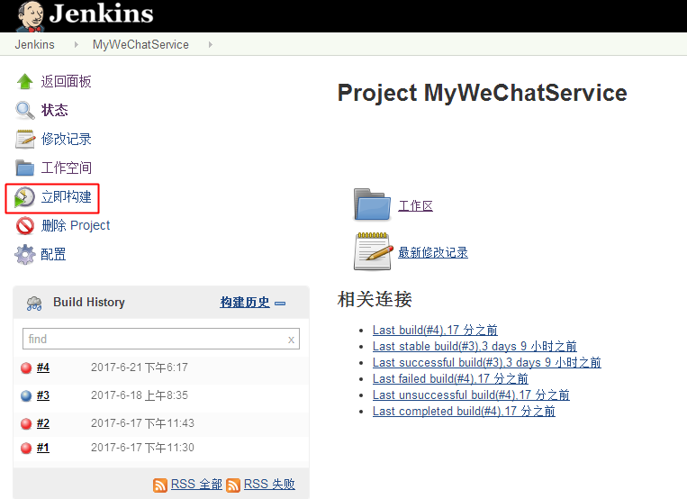
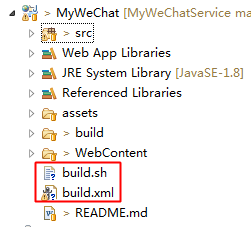

## 引入Jenkins构建的缘由

先梳理下我们先前的代码上线流程：

* 本地代码编写
* 本地Web服务器验证
* 代码上传GitHub
* 通过Eclipse将Java Web工程编译、打包成war文件
* 通过网络工具如WinSCP将war包上传线上Web服务器
* 线上Web服务器运行更新后的war，支持新的功能上线成功
上面的过程中，4、5、6步骤，其实可以通过可视化的形式，一键完成，如下图所示：

构建平台地址：[http://120.25.220.14:8082](http://120.25.220.14:8082)

只需点击“立即构建”按钮，就能完成新功能的上线，是不是很方便？
## Jenkins构建流程

* 从代码库拉去代码（本例中是从GitHub上拉去代码）
* 云端编译打包
* 云端发布

## 具体实现

本例中的Jenkins服务器是同微信小助手的Web Service在同一物理机上的。
为了支持Jenkins编译，源于的小助手工程添加了build.xml和build.sh两个文件：

Jenkins的构建控制：

* 创建新的Jenkins Job时，会绑定对于项目的git库地址
* Jenkins从GitHub将代码拉取到本地；
* 执行编译脚本build.sh
* build.sh脚本调用Ant命令进行编译和上线发布（build.xml是Ant的控制脚本）

ps：Ant是一种用于构建控制的工具，类似同于C/C++中常见的Make CMake，Java中常见的Maven和Gradle；

## 项目地址

Java代码：[http://github.com/CaiquanLiu/MyWeChatService.git](http://github.com/CaiquanLiu/MyWeChatService.git)

Python代码：[https://github.com/CaiquanLiu/MyTuringService](https://github.com/CaiquanLiu/MyTuringService)