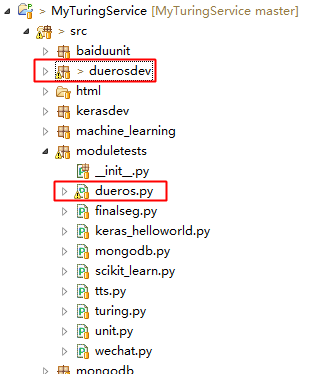

目前开放语音能力的平台已经不少，但能够完整的端到端的解决方案，百度的DuerOS应该是最完善的一个。先前的DuerOS能力通过SDK的形式来提供，当前最新的DuerOS完全兼容亚马逊的AVS协议，并基于Http/2的网络请求对外提供能力。

# DuerOS开放平台地址

[http://open.duer.baidu.com/openduer/main/index](http://open.duer.baidu.com/openduer/main/index)

# DuerOS能力接入

AI小助手以模块的形式接入了DuerOS的能力，主要完成的工作包括：

* 基于OAuth协议的Token获取；
* 基于Http/2 get的长链接建立；
* 基于Http/2 multipart-form-data语音状态和音频流的上传；

其中，
Token的获取因为涉及到OAuth协议中对页面的交互，所以Token通过修改并运行DuerOS Java SDK，通过过程中打Log的方式直接过去Token，然后填写到AI小助手中进行测试使用；

Python的Http/2是基于Hyper的，基于multipart-form-data的数据上传操作可以参考：

[《基于Python Hyper实现Http2的multipart/form-data数据上传》](https://caiquanliu.github.io/2017/07/21/%E5%9F%BA%E4%BA%8EPython-Hyper%E5%AE%9E%E7%8E%B0Http2%E7%9A%84multipart-form-data%E6%95%B0%E6%8D%AE%E4%B8%8A%E4%BC%A0/)

# 模块工程目录

其中，

duerosdev：DuerOS模块
moduletests/dueros.py：测试代码

# 项目地址

Java代码：[http://github.com/CaiquanLiu/MyWeChatService.git](http://github.com/CaiquanLiu/MyWeChatService.git)

Python代码：[https://github.com/CaiquanLiu/MyTuringService](https://github.com/CaiquanLiu/MyTuringService)