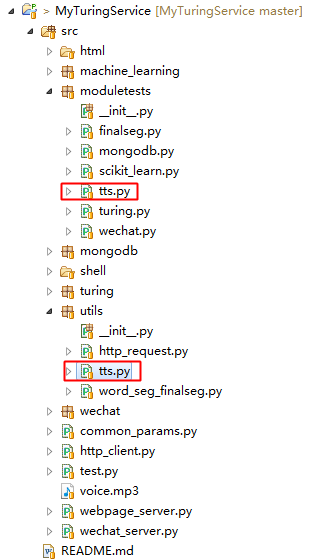

发声是AI机器人必备的基本技能，其中一个关键的技术模块就是TTS（Text To Speech），将文本内容转化为声音（如pcm流）。

AI小助手中使用的TTS模块来自百度语音： [http://yuyin.baidu.com/](http://yuyin.baidu.com/)。

# 模块在工程中的位置

其中，

* utils/tts.py：百度TTS模块封装；
* moduletests/tts.py：TTS模块测试程序；

# 项目地址
Java代码：[http://github.com/CaiquanLiu/MyWeChatService.git](http://github.com/CaiquanLiu/MyWeChatService.git)
Python代码：[https://github.com/CaiquanLiu/MyTuringService](https://github.com/CaiquanLiu/MyTuringService)