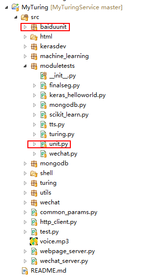

目前市面上的AI接口大多都只能满足固定场景的问答，比如，

* “今天深圳天气怎么样？”

* “今天百度的股票怎么样？”
 
但我们只能被动的接收并展示对方处理的结果。

很多时候我们希望我们自己能够具备语义理解的能力，并自己来控制处理的过程和结果。比如，

* “我媳妇的生日是哪天呀？”

我们希望语义理解能够识别，

* 询问的类别：“生日询问”
* 生日对象：“我媳妇”

有了这些关键信息，我们就可以做自己的定制处理了，比如，将我预先保存在数据库中关于我媳妇生日的信息返回给自己的客户端。具备这种能力我们就可以做各种定制性的需求，但自己来通过语义识别来进行语义分类，和关键信息提取还是挺有难度的（简单的正则匹配灵活性太差）。如果想尽快的满足这样的需求，百度的UNIT接口是不错的选择。

# 百度UNIT接口地址
[http://ai.baidu.com/tech/unit](http://ai.baidu.com/tech/unit)

# 模块项目地址
MyTuringService中集成了UNIT接口，

其中，

* baiduunit:UNIT模块；
* moduletests/unit.py：测试模块；

# 项目地址

Java代码：[http://github.com/CaiquanLiu/MyWeChatService.git](http://github.com/CaiquanLiu/MyWeChatService.git)

Python代码：[https://github.com/CaiquanLiu/MyTuringService ](https://github.com/CaiquanLiu/MyTuringService )