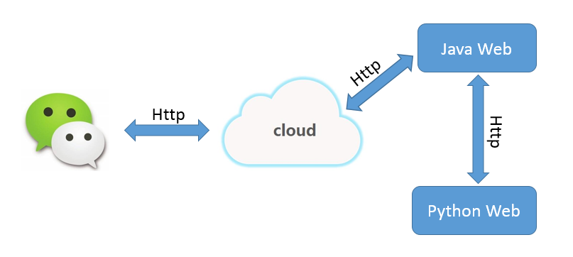

# （一）功能描述

Eddy的AI小助手是一个个人微信公众号，这个个人的公众号主要是作为AI系统信息输入的入口，通过公众号微信页面就可以把请求的文本和语音请求发送到自己配置的后台服务器。后台服务器接收到文本和语音请求后，处理生成回复内容，并将结果以文本、页面或语音的形式返回给微信客户端。

# （二） 系统组成
AI小助手由输入端、后台端两个基本部分组成。

## 1. 输入端

输入端直接采用微信公众号，这样不仅稳定、可靠，同时，很好的解决了Android和iOS的跨平台问题。

微信公众号与后台以XML形式进行通信，具体的规范参考微信公众平台技术文档：[mp.weixin.qq.com](mp.weixin.qq.com)

## 2. 后台端

后台端由Java后台服务和Python后台服务两个部分组成，Java后台服务主要响应微信客户端的请求，Python后台服务主要用于机器学习，并响应Java后台服务的请求：

**后台配置：**

主机：阿里云ECS

系统：Ubuntu 14.04

**Java Web引擎：**

WebServer：Tomcat 9

框架选择：只使用最基本的Servlet

**Pyton Web引擎：**

WebServer：Tornado

**Java第三方组件：**

Log组件：Log4j

XML解析组件：XStream

网络爬虫（Html解析）：HtmlParser

**Pathon第三方组件：**

Http请求：Requests

**第三方服务：**

语音识别：百度语音（yuyin.baidu.com/）

语音合成：百度语音（yuyin.baidu.com/）

NLP处理：图灵机器人（www.tuling123.com/），后期可能会使用自己编写的处理模
# （三）开发环境

JavaIDE：Eclipse JavaEE

Python IDE：PyDeb+Eclipse

文件传输：WinSCP

控制台：Putty

# （四）项目代码

Java代码：[github.com/CaiquanLiu/MyWeChatService.git](github.com/CaiquanLiu/MyWeChatService.git)

Python代码：[github.com/CaiquanLiu/MyTuringService](github.com/CaiquanLiu/MyTuringService)