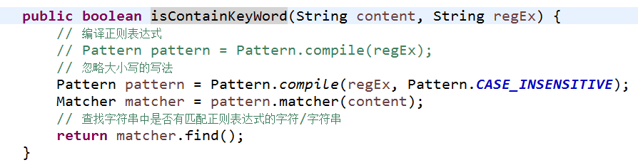

# 需求提出

上一篇文章中我们接入了图灵机器人，通过图灵机器人接口，我们可以实现查天气、看股票、听故事这样的需求。但如果我现在需要查看下我的简书上有哪些文章该如何处理呢？显然通过图灵机器人接口是不能实现的，这里就需要我们自己来完成语义的解析，同时，通过网络爬虫来爬取我在简书上的文章列表。下面我们以“我们简书上有哪些文章？”为例，来说明AI小助手中，自定义语义解析和内容抓取是如何实现的。

# 语义解析

在AI小助手中对语义的解析分为两个层次：

## 1 理解意图

意图就是要干什么，也是后台处理的能力范围。对于图灵机器人，它的能力包括“笑话大全”、“故事大全”、“成语接龙”等等：

在接收到用户请求后，图灵机器人会首先分析该请求和自己的那一种能力相对应，如果超过自己的能力范围，图灵机器人便无法进行处理。如果询问图灵机器人“我的简书上有哪些文章？”，用户的意图不在图灵的能力范围之内，它是无法做出正确回复的。

## 2 确定意图参数

在获取意图之后，就需要确定该意图对应的具体参数。比如“今天天气怎么样？”，图灵机器人能够获取该请求的意图是“天气查询”，但它不知道查询什么地方的天气，所以，也是无法给出正确的答复的。所以正确的询问方式应该是“今天深圳天气怎么样？”图灵机器人在识别到“天气查询”的意图后，还会提取“今天”和“深圳”这样的关键参数，从而返回正确的回复。

## 3 AI小助手的语义解析

AI小助手采用关键字匹配的方式来分层获取意图和意图对应的参数。对于“我的简书上有哪些文章？”，AI小助手对先匹配关键字“简书”获取意图，然后通过关键字“文章”来获取“简书”意图下的关键参数。

关键字的匹配使用了Java的正则表达式。其中，“简书”意图的匹配规则，

    private final String REG_EX_JIANSHU = "简书|jianshu";

“文章”参数的匹配规则，

    private final String REG_EX_ARTICLE = "文章|article";

意图和对应参数的提取都是基于字符串查找的，

# 内容爬取

在正确获取到请求的意图和对应参数后，需要给出正确的答复。对于“我的简书上有哪些文章？”这样的请求，我们可以通过网络爬虫来爬取自己需要的信息。在AI小助手中，采用了HtmlParser（htmlparser.sourceforge.net/）对个人的简书文章进行分析，从而爬取需要的信息。

# 自定义语义解析与图灵机器人配合使用

自定义语义解析可以同图灵机器人接口配合使用。首先进行自定义的语义解析，如果解析失败再通过图灵机器人接口进行解析。这样既可以满足像“我的简书上有哪些文章？”这样自定义能力，又可以完成像“今天深圳天气怎么样？”这样的通用能力。

# AI小助手自定义语义解析和内容抓取效果

# 项目代码

Java代码：[github.com/CaiquanLiu/MyWeChatService.git](github.com/CaiquanLiu/MyWeChatService.git)

Python代码：[github.com/CaiquanLiu/MyTuringService](github.com/CaiquanLiu/MyTuringService)