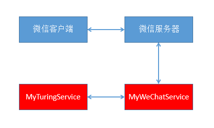
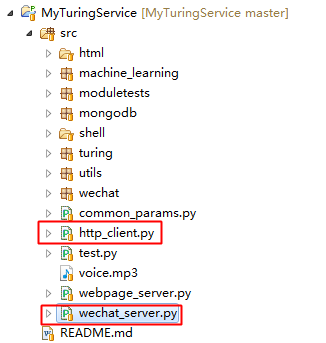

基于Python的MyTuringService主要用于进行数据处理，并响应来自Java微信服务器（MyWeChatService）的请求，数据流框图如下所示，

其中，
* 微信客户端：才权的AI小助手微信公众号客户端；
* 微信服务器：腾讯针对有微信的后台服务器；
* MyWeChatService：基于Tomcat的Java WebServer，用于与微信公众号进行绑定；
* MyTuringServcie：基于Tornado的Python WebServer，用于进行离线数据处理和响应MyWeChatService的请求；

MyTuringService WebServer入口，

其中，

* wechat_server.py：MyTuringService WebServer入口；
* http_client.py：模拟MyWeChatService的Http请求（用于测试）；

# 项目地址
Java代码：[http://github.com/CaiquanLiu/MyWeChatService.git](http://github.com/CaiquanLiu/MyWeChatService.git)
Python代码：[https://github.com/CaiquanLiu/MyTuringService](https://github.com/CaiquanLiu/MyTuringService)