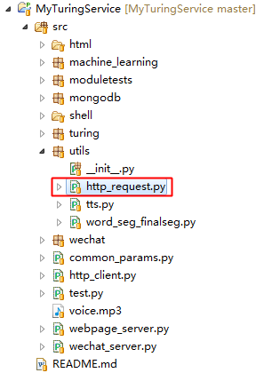

Python的原生Http请求库是urllib，但urlib在实际开发中，使用并不方便。Requests 是用Python语言编写，基于 urllib，采用 Apache2 Licensed 开源协议的 HTTP 库。它比 urllib 更加方便，可以节约我们大量的工作。在AI小助手中的Http请求均是基于Requests的。

Requests在工程中的引用位置，

# Requests库项目地址
[http://www.python-requests.org/en/master/](http://www.python-requests.org/en/master/)

# 项目地址
Java代码：[http://github.com/CaiquanLiu/MyWeChatService.git](http://github.com/CaiquanLiu/MyWeChatService.git)
Python代码：[https://github.com/CaiquanLiu/MyTuringService](https://github.com/CaiquanLiu/MyTuringService)