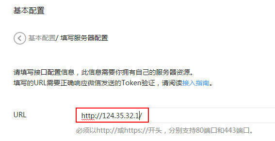
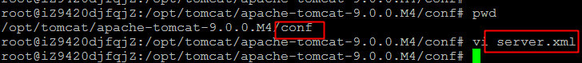
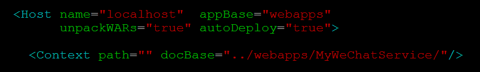

# Tomcat默认响应

当在浏览器中输入Web服务的IP地址时（假设为124.35.32.1），如：

    http://124.35.32.1

Tomcat的默认响应页面为：

    $CATALINA_HOME/webapps/ROOT/index.jsp

Eclipse将Java EE工程以.war形式导出，并放置在“CATALINA_HOME/webapps”目录下。

Tomcat重启后，.war文件会自动解压。如“MyWeChatService.war”会在当前目录下被解压为MyWeChatService，我们可以通过绝对路径的形式访问该工程中的页面：

    http://124.35.32.1/MyWeChatService/index.jsp

# 响应微信服务器请求

微信服务器对个人服务的请求为，

    http://124.35.32.1/

微信公众号中的设置，

当前面临的一个问题是：来自微信服务器的“http://124.35.32.1/”请求到达个人服务后，Tomcat服务器如何将请求转发给MyWeChatService，而不是默认的ROOT？

# Tomcat默认响应设置

修改Tomcat/conf/server.xml文件：

server.xml修改后，重启Tomcat后，“http://124.35.32.1/”的请求便会直接转发给MyWeChatService了

# 参考

[www.111cn.net/sys/Windows/51573.htm](www.111cn.net/sys/Windows/51573.htm)

# 项目代码

Java代码：[github.com/CaiquanLiu/MyWeChatService.git](github.com/CaiquanLiu/MyWeChatService.git)
Python代码：[github.com/CaiquanLiu/MyTuringService](github.com/CaiquanLiu/MyTuringService)