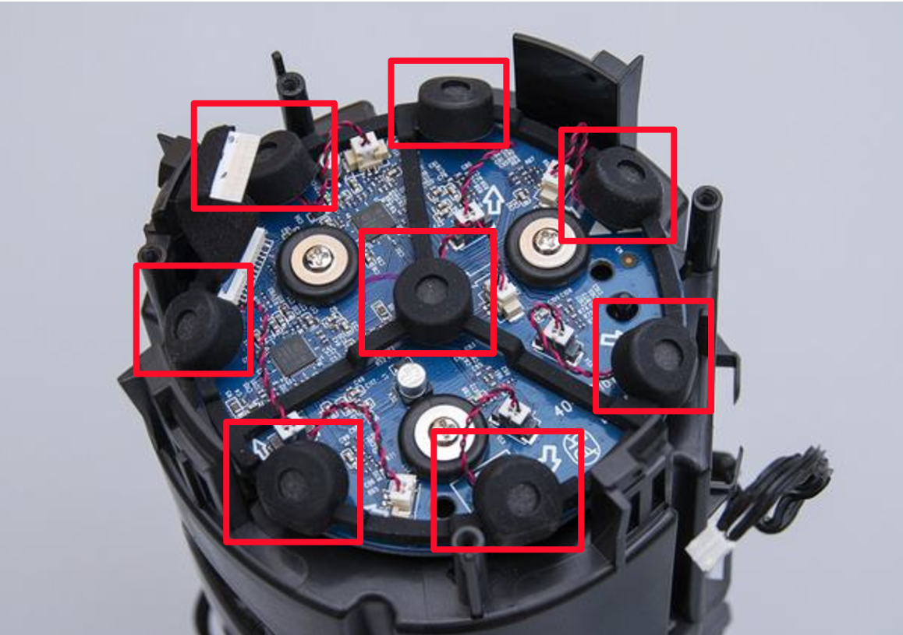

一个完整的智能语音系统主要由如下几个核心部分组成：
* 麦克风阵列
* 唤醒识别
* 语音识别（ASR）
* 自然语言处理（NLP/NLU）
* 内容召回
下面我们逐个介绍各个组成部分
# 麦克风阵列
麦克风用来将模拟的声音信号转换为数字信号，核心器件是ADC（Analog to Digital Controller）控制器，我们在日常生活中常见的麦克风大多是单麦克风，外形如下图所示：

而在智能语音系统中，大多使用麦克风阵列，外形如下图所示：

麦克风阵列在硬件上可以简单的理解成，一个麦克风阵列由多个麦克风组成。图中的麦克风阵列，每个红框就是一个麦克风。
麦克风阵列和普通的单麦克风相比有什么样的优点和缺点呢？
## 优点
首先麦克风阵列具有更好的远场拾音效果，举个不太严谨的例子，使用单麦克风打电话，手机需要放在半米的范围之内，对方才能听清说话的声音；但使用麦克风阵列，手机放在3~5米的范围之内，对方也能清晰的听到语音。
其次，麦克风阵列能够获取声源的角度信息，也就是说能够辨别声音的来源，但单麦克风做不到。
所以，在大多的智能语音系统中均采用麦克风阵列，而百度的DuerOS个人开发套件使用的就是麦克风阵列（包含两个麦克风）。
## 缺点
最显著的缺点就是麦克风阵列的成本相比于单麦克风而言，价格会高出很多。
## 技术点
* 麦克风选型：驻极体/数字麦克风
* 麦克风一致性
* AEC
* 波束合成
* 盲源分离
对具体的技术细节感兴趣的同学可以逐条了解下，这里就不逐一展开了。
# 语音唤醒
语音唤醒的常见场景就是用户使用唤醒词（如百度的“小度小度”，亚马逊的“Alex”）将设备激活。
实际上设备在通过唤醒词激活之前也是一直在工作的，设备一直在录音，并检查录音的数据中是否包含预设的唤醒词（如“小度小度”、“Alexa”），当检测到有唤醒词，设备便进入唤醒状态。
当前对于个人开发者相对友好的免费的唤醒引擎主要有：
* SnowBoy ([https://snowboy.kitt.ai/](https://snowboy.kitt.ai/))
* Pocketsphinx ([https://cmusphinx.github.io/wiki/tutorialpocketsphinx/](https://cmusphinx.github.io/wiki/tutorialpocketsphinx/))
* Sensory ([http://www.sensory.com](http://www.sensory.com))
目前，百度已全资收购了KITTAI（SnowBoy是KITTAI旗下产品），建议开发者直接使用SnowBoy作为唤醒引擎，同时，SnowBoy的唤醒词训练，及唤醒引擎的集成使用也很简洁方便。
## 语音识别（ASR）
语音识别（ASR）简单的说就是讲语音转化为文本，目前几乎所有的语音系统都是先将语音转化为文本，然后再基于文本进行后续的语义理解和处理的。
## 自然语言处理（NLP/NLU）
有了语言识别（ASR）获取的文本信息，后面就进入了自然语言处理单元了，可以说这个步骤是最接近我们概念上理解的人工智能了。这个部分会从输入文本中获取用户的意图和对应的关键信息。举个例子，对应用户输入请求：“我想听周杰伦的歌”，NLU会将请求拆解成如下的结构化结果：
* 意图：听歌
* 词槽：周杰伦
有了NLU的处理结果，就可以获取用户请求的结果了。
## 内容召回
假设你有两个资源库，其中，一个是电影库，一个是歌曲库。当接收NLU的处理结果后，从意图（听歌）上，你可以判别用户希望从歌曲库中获取资源，从词槽（周杰伦）可以判断用户想听歌曲的类别。有了意图和词槽就能从资源库中检索到用户期望的结果，并将结果按请求的路径返回。
# 完整过程
下面我们将上面的各个核心部分连贯起来，想象茶几上放着一个智能音响，用户坐在两米外的沙发上，用户通过语音发出请求“小度小度”，音响的提示灯亮起指示激活状态，用户说“我想听周杰伦的歌”，稍后，音响播放周杰伦的青花瓷。
* 满足远场（3~5米）拾音：麦克风阵列
* 提示灯亮起指示设备激活：唤醒引擎
* 语音请求转化为文本：语音识别（ASR）
* 从文本中识别出意图（听歌）和词槽（周杰伦）：自然语言处理（NLU）
* 通过意图和词槽返回结果：内容召回
