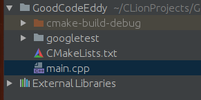
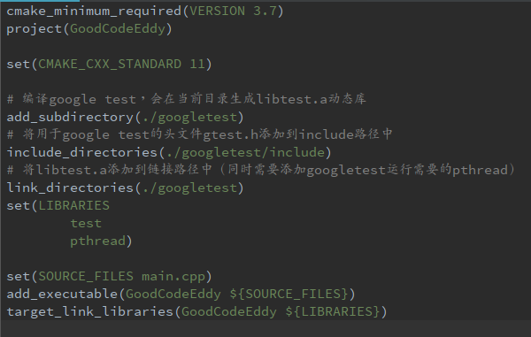
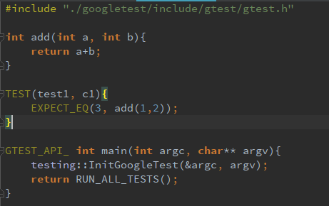
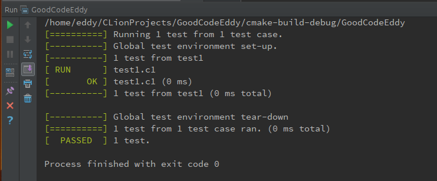

## 说明
CLion是C++IDE开发的利器（熟悉AndroidStudio的同学上手CLion应该很快，AndroidStudio是基于IntelliJ IDE的，而IntelliJ和CLion都是JetBrains家的产品），GTest是Google开源的C++测试框架，两者组合对C++环境开发真算得上是双剑合璧。本文通过简单的示例，展示如何在CLion工程中集成GTest测试框架，并进行简单的示例开发。
## 创建CLion工程
## 下载GTest源码
下载地址：<https://github.com/google/googletest>
##将GTest源码添加到CLion工程中
解压下载的GTest源码并直接添加到CLion工程中，

## 修改CMakeList.txt

## 编辑main.c

## 运行测试

## 工程代码
github链接：<https://github.com/CaiquanLiu/GTest-CLion-example.git>