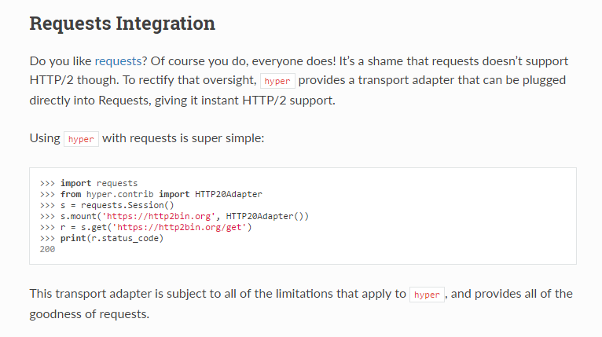
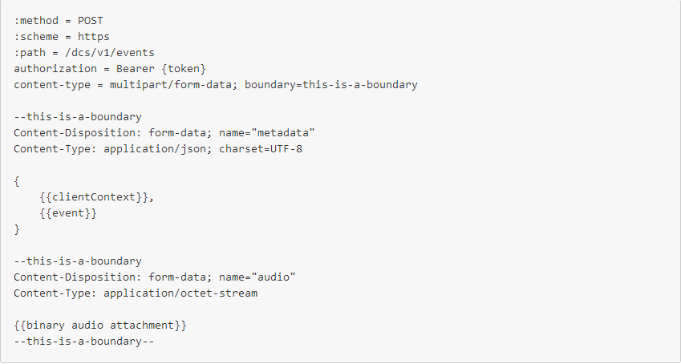
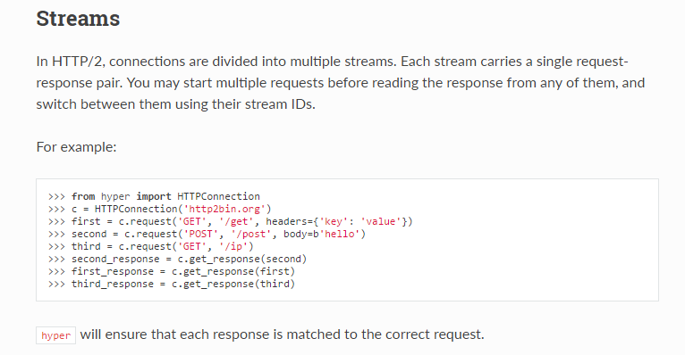
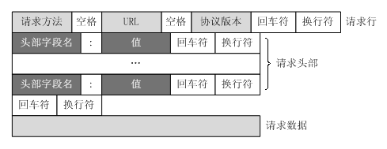

Http/2虽然推出已经不短了，但目前整体的使用率并不高，对应的支持库也并不理想，目前主要的支持库可以参考:[https://github.com/http2/http2-spec/wiki/Implementations](https://github.com/http2/http2-spec/wiki/Implementations)

针对也Python，目前可选的库好像只有Hyper（[http://hyper.readthedocs.io/en/latest/](http://hyper.readthedocs.io/en/latest/)）。Hyper在官网当中声称对Requests有很好的支持，可以将Hyper集成到Request中，完成Requests对Http/2的支持，

但在实际开发中并不理想。比如，默认Request的请求超时时间是无限的，但通过集成Hyper来使用Requests进行get请求时，还是会出现超时的情况，所以，对于Http/2的开发，不建议使用这种方式。

# 开发背景
在开发“才权的AI小助手”过程中，进行了DuerOS云端接口的接入，DuerOS的云端接口是基于Http/2的，而且，需要使用multipart/form-data进行当前状态和语音数据流的上传。

[http://open.duer.baidu.com/doc/dueros-conversational-service/device-interface/voice-input_markdown](http://open.duer.baidu.com/doc/dueros-conversational-service/device-interface/voice-input_markdown)

# 面临问题和解决方案
Hyper中并没有专门的接口用来实现multipart/form-data类型数据的上传，而是直接接收已经序列化后的body数据。

针对这种情况，我们可以Http协议的报文定义，来定制body的内容，最终实现Hyper对multipart/form-data类型数据上传的支持。

# 示例代码

对于DuerOS的语音请求，需要讲语音状态（Json串）和语音数据（PCM音频流）以multipart/form-data的形式进行上传。这里我们通过get_multipart_formed_data（）方法来定制body内容，

    '''
        msg_id：消息ID（messageId字段）
        dialog_req_id：对话ID（dialogRequestId字段）
        format：语音数据格式（format字段）
        data：语音raw data（pcm数据流）
    '''
    def get_multipart_formed_data(self, msg_id, dialog_req_id, format, data):
        
        event={'clientContext':['ai.dueros.device_interface.alerts.AlertsState','ai.dueros.device_interface.audio_player.PlaybackState','ai.dueros.device_interface.speaker_controller.VolumeState','ai.dueros.device_interface.voice_output.SpeechState'], \
       'event':{'header':{'namespace':'ai.dueros.device_interface.voice_input', \
                          'name':'ListenStarted', \
                          'messageId':msg_id, \
                          'dialogRequestId':dialog_req_id}, \
                'payload':{'format':format}}}
        
        event=json.dumps(event)
        
        post_data1=[]
        
        # ListenStarted事件
        post_data1.append('--'+boundary)
        post_data1.append('Content-Disposition: form-data; name="metadata"')
        post_data1.append('Content-Type: text/plain; charset=utf-8')
        post_data1.append('')
        post_data1.append(event)
    #     post_data1.append('--'+boundary+'--')# test
        post_data1.append('')
        
    #     return crlf.join(post_data1).encode('utf-8')# test
        
    #     # Audio data
        post_data1.append('--'+boundary)
        post_data1.append('Content-Disposition: form-data; name="audio"')
        post_data1.append('Content-Type: application/octet-stream')
        post_data1.append('')
         
        body1=crlf.join(post_data1).encode('utf-8')
         
        body2=data
         
        post_data3=[]
        post_data3.append('--'+boundary+'--')
        post_data3.append('')
        body3=crlf.join(post_data3).encode('utf-8')
         
        upload_data=body1+b'{0}'.format(crlf)+body2+b'{0}'.format(crlf)+body3
         
        return upload_data

语音状态和数据上传，

    '''
        msg_id：消息ID（messageId字段）
        dialog_req_id：对话ID（dialogRequestId字段）
        format：语音数据格式（format字段）
        data：语音raw data（pcm数据流）
    '''
    def voice_raw_data_upload(self, msg_id, dialog_req_id, format, data):
        post_body=self.get_multipart_formed_data(msg_id, dialog_req_id, format, data)
        self.conn.request('POST', path_upload_voice_data, headers=self.headers, body=post_body)
        resp = self.conn.get_response()
          
        return resp.read()

# 完整代码参考

完整的代码可以参考
[《Eddy的AI小助手-百度DuerOS模块接入(23)》](https://caiquanliu.github.io/2017/07/21/Eddy%E7%9A%84AI%E5%B0%8F%E5%8A%A9%E6%89%8B-%E7%99%BE%E5%BA%A6DuerOS%E6%A8%A1%E5%9D%97%E6%8E%A5%E5%85%A5-23/)