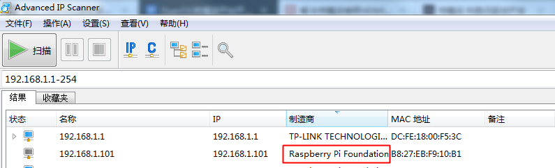
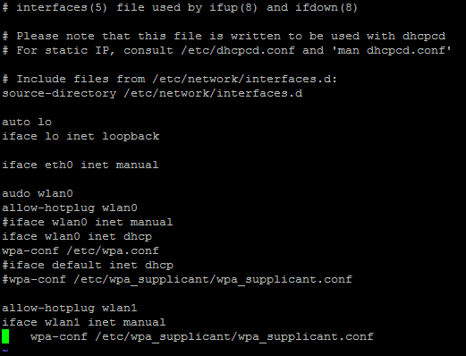
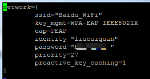

## 开箱清单
正常情况下，树莓派开箱只有一块主控板，显然是无法正常运行的。
## 开机必要配件
* tf卡：最好是已安装了raspbain系统（系统从tf卡启动）；
*  micro USB线（树莓派通过micro USB进行供电）；
*  5V电源（可选，可以通过USB线从电脑取电）；
## 交互模式
添加了上面的配件树莓派就可以正常工作了，但没有输入和输出配件，对应使用者和开发者都是毫无意义的。
### 1屏幕+键盘+鼠标
最简单的交互方式就是和台式机一样通过屏幕、鼠标、键盘进行交互。必要配件：

* HDMI线（树莓派只提供了HDMI接口）；
* 键盘；
*  鼠标；

这样上电开机就和使用普通的Linux主机一样了。
很多时候显示器只有VGA接口，这时候需要添加配件：

* HDMI转VGA接口（要求使用有源接口，无源接口可能会损坏树莓派主板）；

同时，需要修改tf卡中的配置文件（config.txt文件），如：

    # For more options and information see
	# http://rpf.io/configtxtreadme
	# Some settings may impact device functionality. See link above for details

	# uncomment if you get no picture on HDMI for a default "safe" mode
	#hdmi_safe=1

	# uncomment this if your display has a black border of unused pixels visible
	# and your display can output without overscan
	disable_overscan=1

	# uncomment the following to adjust overscan. Use positive numbers if console
	# goes off screen, and negative if there is too much border
	#overscan_left=16
	#overscan_right=16
	#overscan_top=16
	#overscan_bottom=16

	# uncomment to force a console size. By default it will be display's size minus
	# overscan.
	#framebuffer_width=1280
	#framebuffer_height=720

	# uncomment if hdmi display is not detected and composite is being output
	hdmi_force_hotplug=1

	# uncomment to force a specific HDMI mode (this will force VGA)
	hdmi_group=2
	hdmi_mode=9

	# uncomment to force a HDMI mode rather than DVI. This can make audio work in
	# DMT (computer monitor) modes
	hdmi_drive=2

	# uncomment to increase signal to HDMI, if you have interference, blanking, or
	# no display
	config_hdmi_boost=4

	# uncomment for composite PAL
	#sdtv_mode=2

	#uncomment to overclock the arm. 700 MHz is the default.
	#arm_freq=800

	# Uncomment some or all of these to enable the optional hardware interfaces
	#dtparam=i2c_arm=on
	#dtparam=i2s=on
	#dtparam=spi=on

	# Uncomment this to enable the lirc-rpi module
	#dtoverlay=lirc-rpi

	# Additional overlays and parameters are documented /boot/overlays/README

	# Enable audio (loads snd_bcm2835)
	dtparam=audio=on

	#dtoverlay=hifiberry-dacplus
参考：<http://www.jianshu.com/p/1b5f21fbb928>

### 2 SSH远程登录
raspbain系统默认开启了ssh服务，可以通过终端进行登录，这里终端推荐Putty；
ssh登录需要知道树莓派的IP地址、用户名和密码；
其中，树莓派的默认用户名和密码为：

* 用户名：pi；
* 密码：raspberry

IP的获取，可以通过IP嗅探器来获取，比如Advanced IP Scanner。将树莓派同扫描器的宿主主机置于同一网段（比如连接到同一路由器）。

扫描到IP后，就可以通过SSH进行登录。
## 上网
通过修改/etc/network/interfaces配置文件实现上网配置，如：

参考：<http://shumeipai.nxez.com/2016/09/17/raspberry-pi-set-up-a-wireless-internet-access.html>

至此，树莓派就基本满足使用和开发需求了。