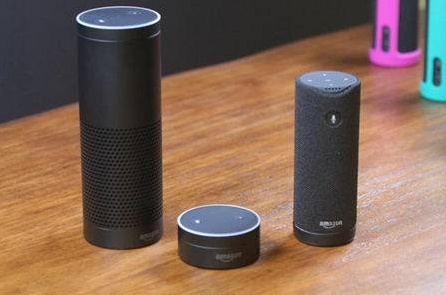

随着人工智能技术的日益成熟，智能硬件这个“古老”的领域也慢慢焕发生机，最典型的是各大互联网公司推出的智能音箱产品。亚马逊集成Alex的Echo，谷歌集成GoogleAssistant的GoogleHome已在市场上占据先机。苹果集成Siri的智能音箱以及国内百度集成DuerOS的智能音箱已在路上。相信微软集成Cortana的智能音箱也会不久面世。

各大互联网巨头的终极目标是推广自己的智能操作系统，而音箱这个入口就变得至关重要。和传统的手机类语音助手不同，智能音箱能够实现远场识别，在3~5米的范围内响应用户的语言命令。这样的能力大大扩展了语音的使用场景，甚至音箱可以作为家庭智能中枢，以音箱为中心控制家中的空调、电视、灯具等智能终端。

**从用户角度，智能音箱的组成包括：**

* 音箱本身
* 手机端APP
* 音箱控制的智能外设，如空调、电视、灯光等

**从技术组成角度，智能音箱包括：**

* 麦克风前端阵列
* 唤醒识别
* 语音识别
* 自然语言处理
* 语言合成
* 移动APP及外设控制

相比于手机类的语音助手，智能音箱最大的区别是麦克风前端阵列。

**麦克风前端阵列的核心技术包括：**

* 回声抵消（AEC）
* 混响消除
* 角度识别
* 波束合成（BeamForming）

目前麦克风阵列比较成熟的是科胜讯（Conexant）的双MIC和四MIC方案，国内也有麦克风阵列厂商比如声智科技（SoundAI）但真实效果不好评估。

**选择对科胜讯的方案进行分析，主要出于两方面的考虑：**

* 科胜讯的方案相对成熟，技术文档相对完善；
* 科胜讯的方案不但提供麦克风阵列，同时，搭建了包括语音唤醒、识别、自然语言处理、手机与音响互联等功能的整体实现方案，并将实现源码在GitHub上分享。

后续的文章将会从硬件、驱动、软件、互联等多个角度对科胜讯的麦克风阵列方案进行全面的分析，敬请期待~

**参考阅读：**

智能音箱技术概览： [blog.csdn.net/jackytintin/article/details/62040823](blog.csdn.net/jackytintin/article/details/62040823)