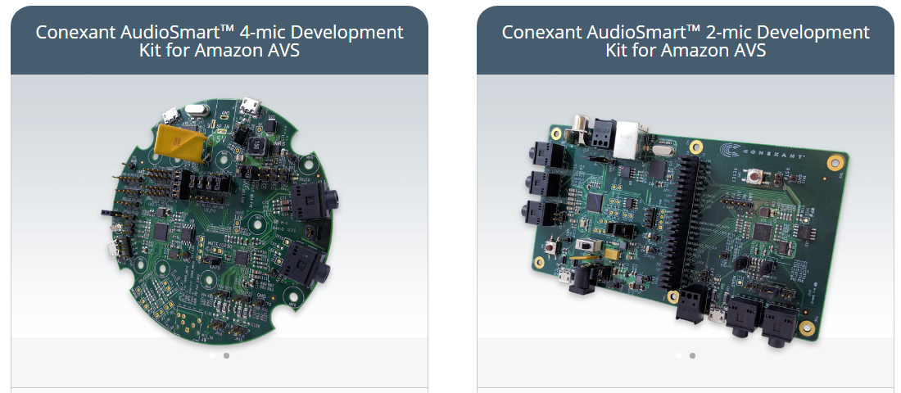

科盛讯麦克风阵列方案的项目主页：<http://www.conexant.com/amazon-avs/>

4MIC和2MIC的原理基本一致，我们后续将以4MIC方案作为示例进行分析。
麦克风阵列智能音响由声智讯的麦克风阵列和控制板两部分组成：

其中，控制板可以选择树莓派（Raspberry）和Linkplay：

下面我们先了解下基于麦克风阵列的智能音响方案整体工作情况：
<https://youtu.be/aleO-FwND30>
系统运行的数据流如下：

* 四个MIC独立获取数据并通过DMIC接口将数据流传递给CX20924芯片（麦克风核心芯片）
* [可选]CX20924完成唤醒识别（如“Alexa”），并通过GPIO1通知控制板

* CX20924需要完成单MIC的回声抵消（AEC）、混响/噪声消除，及多MIC的波束角度识别（没有找到对控制版的输出方式）、波束形成（BeamForming），最终通过USB接口将数据传递给控制板；
* [可选]控制板接受到麦克风阵列处理后的数据后通过第三方组件实现唤醒识别功能（如Sensory & KITT.AI唤醒引擎）；
* 控制板将数据流发送给AVS进行语音识别和自然语言处理，并返回处理结果；
* 控制板将返回的结果已PCM的形式通过CX22721芯片进行播放（I2C为控制接口、I2S为PCM数据接口）
* CX22721一方面将数字信号转换为模拟信号（DAC）传输给功放（喇叭）单元进行播放，另一方面通过I2S接口传递给CX20924进行回声抵消处理（AEC）；